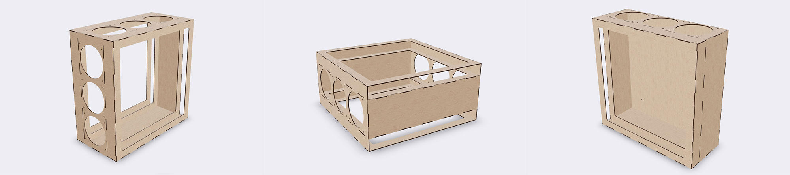

# Nukit Open Air Purifier Builder

Browser-based builder for DIY clean-air purifier designs. It creates live 3D previews, laser-cut SVG drawings, and printable 3MF kits from explicit parametric models.



## What It Builds

- Laser-cut Nukit Open Air boxes using HVAC filters, PC fans, finger-jointed panels, kerf fit, and SVG export.
- 3D-printable Nukit Tempest boxes from a separate OpenSCAD-ported model, including 1-filter, 2-filter, and 4-side-filter layouts.
- Desktop-printable 3MF kits with print-bed chunking, alignment-pin holes, split plates, and previewed print parts.
- Generated printable references: modular Corsi-Rosenthal box and donut HEPA fan adaptor.
- Curated static Printables references where source geometry is intentionally fixed, not pretending to be parametric.
- Shareable URLs that preserve design, parts, fabrication method, preview mode, and advanced fit settings.

The laser-cut Nukit model and the 3D-printable Tempest model are intentionally separate. Their shared concepts are filter size, fan size, layout, and export workflow; their construction details can diverge.

## FilterBoxBuilder Parity

This app keeps the FilterBoxBuilder settings that are useful for safe builds and shareable fabrication output:

- filter dimensions, fan size, filter count, wall fan banks, material thickness, kerf/fit allowance, screw holes, reference scale, and split-frame choice;
- advanced finger-slot and dovetail tuning for builders who need to match a specific material or cutter;
- legacy FilterBoxBuilder URL aliases such as `x`, `y`, `filter_height`, `fan_diameter`, `thickness`, `burn`, `screw_holes`, `FingerJoint_*`, and `DoveTail_*`.

Some upstream-style controls are intentionally not first-path UI. The default workflow asks for design, parts, and print/laser setup first; advanced joint tuning is available in the Advanced tab. Fixed external designs stay fixed instead of pretending to be parametric.

See [docs/filterboxbuilder-parity.md](./docs/filterboxbuilder-parity.md) for the kept/advanced/removed story.

## Requirements

- Bun. The repo uses `bun.lock`, `bun test`, and Bun script execution.
- A modern browser with WebGL for the Three.js preview.
- OpenSCAD is optional. It is only needed for the Tempest equivalence/oracle test suite.

## Quick Start

Install dependencies:

```sh
bun install
```

Run the app:

```sh
bun run dev
```

Open the local app at `http://127.0.0.1:5173`.

## Validation

Run core checks:

```sh
bun test
bun run build
```

Optional port checks against the Boxes.py reference port:

```sh
bun run port:audit
bun run oracle:airpurifier
```

Run optional OpenSCAD oracle checks for the Tempest 3D-print port:

```sh
bun run test:openscad
```

This requires the `openscad` CLI on `PATH`, or `OPENSCAD_BIN=/path/to/OpenSCAD`. The suite renders the checked-in Tempest `.scad` reference and compares parsed oracle metrics with the TypeScript/JSCAD port.

## Model Correctness

- Browser previews use Three.js for display.
- Generated laser files come from the laser fabrication model.
- Generated 3MF files come from the TypeScript/JSCAD print model.
- The Tempest print model is a hand port of the OpenSCAD reference in [references/tempest-openscad-reference](./references/tempest-openscad-reference).
- OpenSCAD oracle tests compare reference-derived dimensions and layout metrics against the port. They do not replace manual print-fit validation.

## Repository Layout

- `src/app/`: browser workbench, URL state, tabs, controls, and styles.
- `src/domain/`: purifier settings, presets, units, and specialized printable design models.
- `src/fabrication/`: laser panels, cut geometry, assembly model, print kit planning, and 3MF export.
- `src/ports/boxes/`: small Boxes.py-inspired drawing/kernel port used for SVG generation.
- `src/rendering/`: Three.js previews for assembled models and fabrication sheets.
- `src/resources/`: static reference metadata used by the app.
- `public/vendor/`: browser-deployable preview assets with their own provenance notes.
- `references/`: upstream source/reference material that is not loaded directly by the app.
- `scripts/`: comparison and audit scripts.
- `test/`: Bun tests covering URL parsing, fabrication workflows, generated print kits, and 3MF output.

## Assets And Licenses

The project code is GPL-3.0, matching the upstream Nukit open hardware repository. Browser preview assets under `public/vendor/` keep their own source and license notes; see [docs/assets-and-licenses.md](./docs/assets-and-licenses.md).

## Safety

This app generates fabrication files, not a certified appliance. Verify material safety, fan wiring, filter fit, laser kerf, printer tolerances, and local electrical requirements before building or deploying an air purifier.
