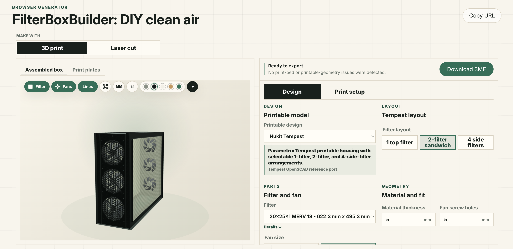

# Nukit Open Air Purifier Builder

Browser-based builder for DIY clean-air purifier designs. It creates live 3D previews, laser-cut SVG drawings, and printable 3MF kits from explicit parametric models.



## What It Builds

- Parametric laser-cut and 3D-printed filter boxes.
- One static reference option for designs that are not parametric.

The laser-cut Nukit model and the 3D-printable Tempest model are intentionally separate. Their shared concepts are filter size, fan size, layout, and export workflow; their construction details can diverge.

## Requirements

- Bun. The repo uses `bun.lock`, `bun test`, and Bun script execution.
- A modern browser with WebGL for the Three.js preview.

## Quick Start

Install dependencies:

```sh
bun install
```

Run the app:

```sh
bun run dev
```

Open the local app at `http://127.0.0.1:5173`.

## Validation

Run core checks:

```sh
bun test
bun run build
```

Optional port checks against the Boxes.py reference port:

```sh
bun run port:audit
bun run oracle:airpurifier
```

## Model Correctness

- Browser previews use Three.js for display.
- Generated laser files come from the laser fabrication model.
- Generated 3MF files come from the parametric model built on the Manifold CSG kernel, which guarantees watertight, slicer-ready meshes.
- The Tempest print model is a hand port of the OpenSCAD reference in [references/tempest-openscad-reference](./references/tempest-openscad-reference); watertightness and topology are pinned by manifold/genus tests. They do not replace manual print-fit validation.

## Repository Layout

- `src/app/`: browser workbench, URL state, tabs, controls, and styles.
- `src/domain/`: purifier settings, presets, units, and specialized printable design models.
- `src/fabrication/`: laser panels, cut geometry, assembly model, print kit planning, and 3MF export.
- `src/ports/boxes/`: small Boxes.py-inspired drawing/kernel port used for SVG generation.
- `src/rendering/`: Three.js previews for assembled models and fabrication sheets.
- `src/resources/`: static reference metadata used by the app.
- `public/vendor/`: browser-deployable preview assets with their own provenance notes.
- `references/`: upstream source/reference material that is not loaded directly by the app.
- `scripts/`: comparison and audit scripts.
- `test/`: Bun tests covering URL parsing, fabrication workflows, generated print kits, and 3MF output.

## Assets And Licenses

The project code is GPL-3.0, matching the upstream Nukit open hardware repository. Browser preview assets under `public/vendor/` keep their own source and license notes; see [docs/assets-and-licenses.md](./docs/assets-and-licenses.md).

## Safety

This app generates fabrication files, not a certified appliance. Verify material safety, fan wiring, filter fit, laser kerf, printer tolerances, and local electrical requirements before building or deploying an air purifier.
